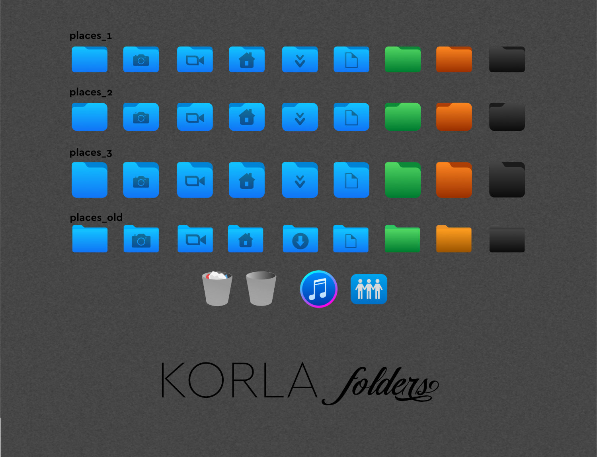

# korla-folders

Three folder icon sets for Korla icon theme.
Korla theme: https://github.com/bikass/korla

## Installation

Extract one of the folders and rename to "scalable" . Copy to korla/places/

For other themes: just folow naming conventions of your theme folders.
    

## Preview

## License

[GPL3](https://www.gnu.org/licenses/gpl-3.0-standalone.html)
